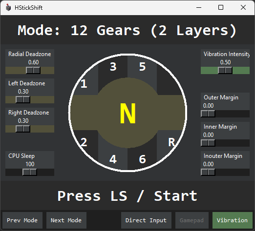
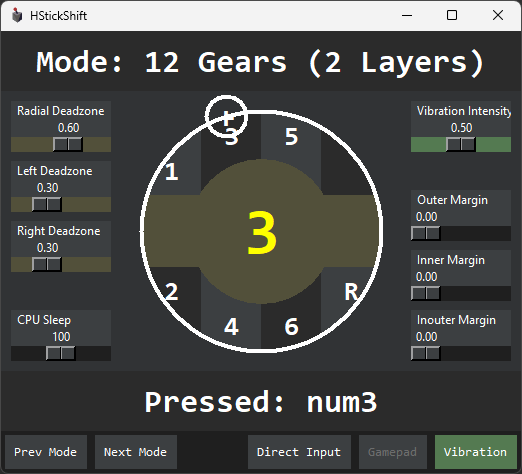

# hshiftstick
 - H shifter simulation with controller analog sticks
 - Binds analog positions to keyboard keys
 - Multiple gear amounts and gear layer support

Feature rich interface!             |  Many input and output options!
:-------------------------:|:-------------------------:
  |  

# Required packages
 - python
 - Xinput-Python
 - pyautogui
 - pydirectinput
 - tkinter
 - vgamepad

# Pyinstaller command
 - python -m PyInstaller --onefile -w -F --icon='icon.ico' --add-data "icon.ico;." hshiftstick.py

# Optional:
 - [ViGEmBus](https://github.com/ViGEm/ViGEmBus/) for controller emulation